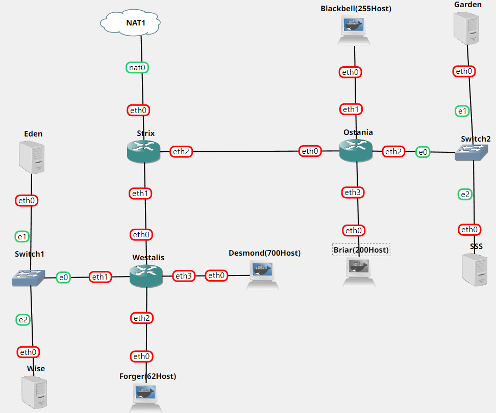
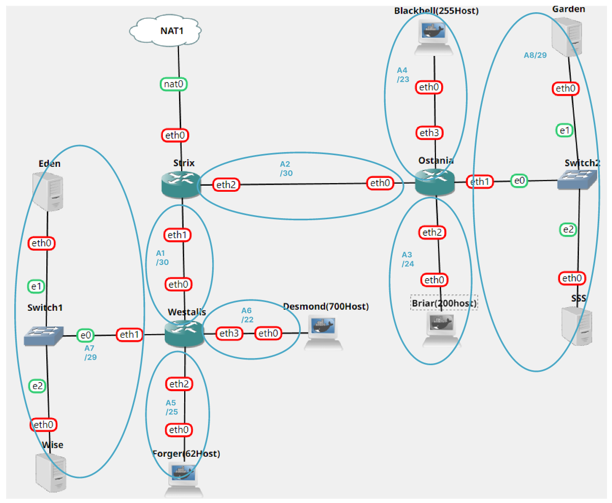
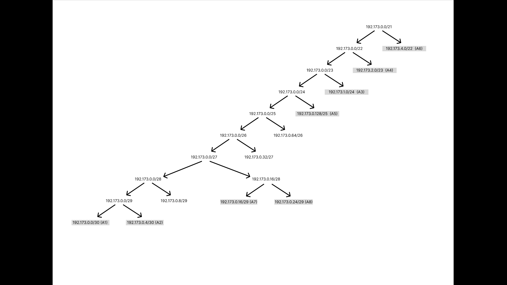

# Jarkom-Modul-5-B01-2022

Anggota :
> Ichsanul Aulia - 05111840007001\
> Alfin Indrawan - 5025201199\
> Graidy Megananda - 5025201188

---
## Tabel Konten
- [Pembagian tugas](#pembagian-tugas)
- [Soal A](#A)
- [Soal B](#B)
- [Soal C](#C)
- [Soal D](#D)
- [Soal 1](#nomor-1)
- [Soal 2](#nomor-2)
- [Soal 3](#nomor-3)
- [Soal 4](#nomor-4)
- [Soal 5](#nomor-5)
- [Soal 6](#nomor-6)

## Pembagian Tugas
> Ichsanul Aulia\
> Alfin Indrawan\
> Graidy Megananda

## A
### Soal
Tugas pertama kalian yaitu membuat topologi jaringan sesuai dengan rancangan yang diberikan Loid. Keterangan :
- Eden adalah DNS Server
- WISE adalah DHCP Server
- Garden dan SSS adalah Web Server
- Jumlah Host pada Forger adalah 62 host
- Jumlah Host pada Desmond adalah 700 host
- Jumlah Host pada Blackbell adalah 255 host
- Jumlah Host pada Briar adalah 200 host

### Penyelesaian

## B
### Soal
Untuk menjaga perdamaian dunia, Loid ingin meminta kalian untuk membuat topologi tersebut menggunakan teknik CIDR atau VLSM setelah melakukan subnetting.

### Penyelesaian
- Subnetting:  

- VLSM Tree:  

 

## C
### Soal
Anya, putri pertama Loid, juga berpesan kepada anda agar melakukan Routing agar setiap perangkat pada jaringan tersebut dapat terhubung.

### Penyelesaian

## D
### Soal
Tugas berikutnya adalah memberikan ip pada subnet Forger, Desmond, Blackbell, dan briar secara dinamis menggunakan bantuan DHCP server. Kemudian kalian ingat bahwa kalian harus setting DHCP Relay pada router yang menghubungkannya.

### Penyelesaian

## Nomor 1
### Soal
Agar topologi yang kalian buat dapat mengakses keluar, kalian diminta untuk mengkonfigurasi Strix menggunakan iptables, tetapi Loid tidak ingin menggunakan MASQUERADE.

### Penyelesaian

## Nomor 2
### Soal
Kalian diminta untuk melakukan drop semua TCP dan UDP dari luar Topologi kalian pada server yang merupakan DHCP Server demi menjaga keamanan.

### Penyelesaian

## Nomor 3
### Soal
Loid meminta kalian untuk membatasi DHCP dan DNS Server hanya boleh menerima maksimal 2 koneksi ICMP secara bersamaan menggunakan iptables, selebihnya didrop.
### Penyelesaian

## Nomor 4
### Soal
Akses menuju Web Server hanya diperbolehkan disaat jam kerja yaitu Senin sampai Jumat pada pukul 07.00 - 16.00.
### Penyelesaian

## Nomor 5
### Soal
Karena kita memiliki 2 Web Server, Loid ingin Ostania diatur sehingga setiap request dari client yang mengakses Garden dengan port 80 akan didistribusikan secara bergantian pada SSS dan Garden secara berurutan dan request dari client yang mengakses SSS dengan port 443 akan didistribusikan secara bergantian pada Garden dan SSS secara berurutan.

### Penyelesaian

## Nomor 6
### Soal
Karena Loid ingin tau paket apa saja yang di-drop, maka di setiap node server dan router ditambahkan logging paket yang di-drop dengan standard syslog level.

### Penyelesaian
