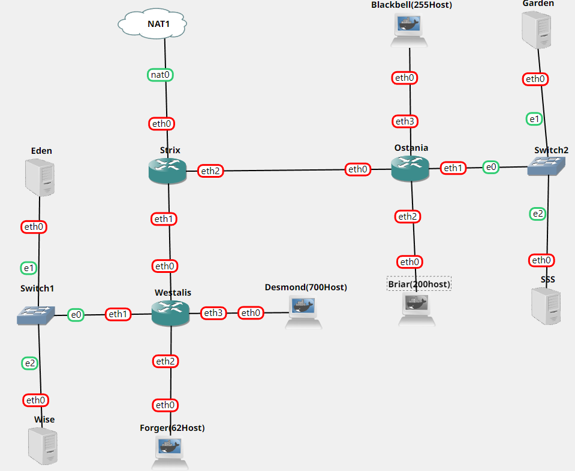
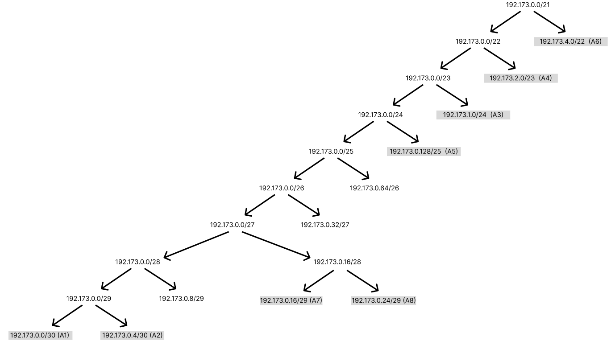

# Jarkom-Modul-5-B01-2022

Anggota :
> Ichsanul Aulia - 05111840007001\
> Alfin Indrawan - 5025201199\
> Graidy Megananda - 5025201188

---
## Tabel Konten
- [Pembagian tugas](#pembagian-tugas)
- [Soal A](#A)
- [Soal B](#B)
- [Soal C](#C)
- [Soal D](#D)
- [Soal 1](#nomor-1)
- [Soal 2](#nomor-2)
- [Soal 3](#nomor-3)
- [Soal 4](#nomor-4)
- [Soal 5](#nomor-5)
- [Soal 6](#nomor-6)

## Pembagian Tugas
> Ichsanul Aulia\
> Alfin Indrawan\
> Graidy Megananda

## A
### Soal
Tugas pertama kalian yaitu membuat topologi jaringan sesuai dengan rancangan yang diberikan Loid. Keterangan :
- Eden adalah DNS Server
- WISE adalah DHCP Server
- Garden dan SSS adalah Web Server
- Jumlah Host pada Forger adalah 62 host
- Jumlah Host pada Desmond adalah 700 host
- Jumlah Host pada Blackbell adalah 255 host
- Jumlah Host pada Briar adalah 200 host

### Penyelesaian


## B
### Soal
Untuk menjaga perdamaian dunia, Loid ingin meminta kalian untuk membuat topologi tersebut menggunakan teknik CIDR atau VLSM setelah melakukan subnetting.

### Penyelesaian
- Subnetting: <br/>


- VLSM Tree: <br/>

<br/>

- Pembagian IP :
### 1. Jumlah Alamat IP
Subnet serta jumlah IP untuk mendapatkan netmask dari tiap subnet ditunjukkan oleh tabel berikut :
| Subnet  | Jumlah IP | Netmask | subnetmask | nid | Broadcast |
| :---         |     :---:      |     :---:      |     :---:      |     :---:      |          ---: |
| A1  | 2 | /30 | 255.255.255.252 | 192.173.0.0 | 192.173.0.3 |
| A2  | 2 | /30 | 255.255.255.252 | 192.173.0.4 | 192.173.0.7 |
| A3  | 201 | /24 | 255.255.255.0 | 192.173.1.0 | 192.173.1.255 |
| A4  | 301 | /23 | 255.255.254.0 | 192.173.2.0 | 192.173.3.255 |
| A5  | 101 | /25 | 255.255.255.128 | 192.173.0.128 | 192.173.0.255 |
| A6  | 701 | /22 | 255.255.252.0	 | 192.173.4.0 | 192.173.7.255 |
| A7  | 4 | /29 | 255.255.255.248 | 192.173.0.16 | 192.173.0.23 |
| A8  | 4 | /29 | 255.255.255.248 | 192.173.0.24 | 192.173.0.31  |
| Total  | 1361 | /21 | 255.255.248.0 | - | - |

SETTING INTERFACE PADA GNS3

- Strix

```
auto eth0
iface eth0 inet dhcp

auto eth1
iface eth1 inet static
        address 192.173.0.1
        netmask 255.255.255.252

auto eth2
iface eth2 inet static
         address 192.173.0.5
         netmask 255.255.255.252
```

- Westalis

```
auto eth0
iface eth0 inet static
        address 192.173.0.2
        netmask 255.255.255.252
        gateway 192.173.0.1

auto eth1
iface eth1 inet static
        address 192.173.0.17
        netmask 255.255.255.248

auto eth2
iface eth2 inet static
         address 192.173.0.129
         netmask 255.255.255.128

auto eth3
iface eth3 inet static
         address 192.173.4.1
         netmask 255.255.252.0
```

- Ostania

```
auto eth0
iface eth0 inet static
          address 192.173.0.6
          netmask 255.255.255.252
          gateway 192.173.0.5

auto eth1
iface eth1 inet static
          address 192.173.0.25
          netmask 255.255.255.248

auto eth2
iface eth2 inet static
          address 192.173.1.1
          netmask 255.255.255.0

auto eth3
iface eth3 inet static
           address 192.173.2.1
          netmask 255.255.254.0
```

- Forger

```
auto eth0
iface eth0 inet static
      address 192.173.0.130
      netmask 255.255.255.128
      gateway 192.173.0.129
```

- Desmond

```
auto eth0
iface eth0 inet static
       address 192.173.4.2
      netmask 255.255.252.0
       gateway 192.173.4.1
```

- Blackbell

```
auto eth0
iface eth0 inet static
       address 192.173.2.2
       netmask 255.255.254.0
       gateway 192.173.2.1
```

- Briar

```
auto eth0
iface eth0 inet static
       address 192.173.1.2
       netmask 255.255.255.0
       gateway 192.173.1.1
```

- SSS

```
auto eth0
iface eth0 inet static
       address 192.173.0.27
       netmask 255.255.255.248
       gateway 192.173.0.25
```

- Garden

```
auto eth0
iface eth0 inet static
       address 192.173.0.26
       netmask 255.255.255.248
       gateway 192.173.0.25
```

- Eden

```
auto eth0
iface eth0 inet static
       address 192.173.0.18
       netmask 255.255.255.248
       gateway 192.173.0.17
```

- Wise

```
auto eth0
iface eth0 inet static
       address 192.173.0.19
       netmask 255.255.255.248
       gateway 192.173.0.17

## C
### Soal
Anya, putri pertama Loid, juga berpesan kepada anda agar melakukan Routing agar setiap perangkat pada jaringan tersebut dapat terhubung.

### Penyelesaian
```
route add -net 192.173.1.0 netmask 255.255.255.0 gw 192.173.0.6                                     
route add -net 192.173.2.0 netmask 255.255.254.0 gw 192.173.0.6                                   
route add -net 192.173.0.24 netmask 255.255.255.248 gw 192.173.0.6                                    
route add -net 192.173.4.0 netmask 255.255.252.0 gw 192.173.0.2                                         
route add -net 192.173.0.128 netmask 255.255.255.128 gw 192.173.0.2                                 
route add -net 192.173.0.16 netmask 255.255.255.248 gw 192.173.0.2 
```

## D
### Soal
Tugas berikutnya adalah memberikan ip pada subnet Forger, Desmond, Blackbell, dan briar secara dinamis menggunakan bantuan DHCP server. Kemudian kalian ingat bahwa kalian harus setting DHCP Relay pada router yang menghubungkannya.

### Penyelesaian
1. Install `apt-get install isc-dhcp-relay -y` pada strix, westalis, dan Ostania, `apt-get install isc-dhcp-server` pada Wise
2. Pada Router (strix, westalis dan Ostania) Edit file `/etc/sysctl.conf` deengan command
    ```
    net.ipv4.ip_forward=1
    net.ipv4.conf.all.accept_source_route = 1
    ```
3. Lakukan sysctl -p


## Nomor 1
### Soal
Agar topologi yang kalian buat dapat mengakses keluar, kalian diminta untuk mengkonfigurasi Strix menggunakan iptables, tetapi Loid tidak ingin menggunakan MASQUERADE.

### Penyelesaian

## Nomor 2
### Soal
Kalian diminta untuk melakukan drop semua TCP dan UDP dari luar Topologi kalian pada server yang merupakan DHCP Server demi menjaga keamanan.

### Penyelesaian

## Nomor 3
### Soal
Loid meminta kalian untuk membatasi DHCP dan DNS Server hanya boleh menerima maksimal 2 koneksi ICMP secara bersamaan menggunakan iptables, selebihnya didrop.
### Penyelesaian

## Nomor 4
### Soal
Akses menuju Web Server hanya diperbolehkan disaat jam kerja yaitu Senin sampai Jumat pada pukul 07.00 - 16.00.
### Penyelesaian

## Nomor 5
### Soal
Karena kita memiliki 2 Web Server, Loid ingin Ostania diatur sehingga setiap request dari client yang mengakses Garden dengan port 80 akan didistribusikan secara bergantian pada SSS dan Garden secara berurutan dan request dari client yang mengakses SSS dengan port 443 akan didistribusikan secara bergantian pada Garden dan SSS secara berurutan.

### Penyelesaian

## Nomor 6
### Soal
Karena Loid ingin tau paket apa saja yang di-drop, maka di setiap node server dan router ditambahkan logging paket yang di-drop dengan standard syslog level.

### Penyelesaian
